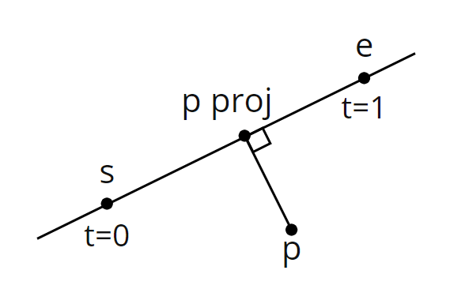

# Generating signed distance fields from TrueType fonts

## Sections
### [Part 1 - Introduction and code setup](#part-1---introduction-and-code-setup-1)
1. [Introduction](#introduction)
1. [The algorithm](#the-algorithm)
1. [Creating a bitmap image](#creating-a-bitmap-image)

### [Part 2 - Calculating the distance](#part-2---calculating-the-distance-1)
1. [The minimum distance to a line](#the-minimum-distance-to-a-line)
1. [The minimum distance to a quadratic Bézier](#the-minimum-distance-to-a-quadratic-bézier)
1. [The cubic polynomial](#the-cubic-polynomial)
1. [The roots of a cubic polynomial](#the-roots-of-a-cubic-polynomial)
1. [The implementation](#the-implementation)

### [Part 3 - Calculating the sign of the distance](#part-3---calculating-the-sign-of-the-distance-1)
1. [The algorithm](#the-algorithm-1)
1. [The crossing number of a line](#the-crossing-number-of-a-line)
1. [The crossing number of a quadratic Bézier](#the-crossing-number-of-a-quadratic-bézier)

### [Part 4 - Generating the texture atlas](#part-4---generating-the-texture-atlas-1)

### [References](#references)

# Part 1 - Introduction and code setup
## Introduction
Popularized by Valve, signed distance fields provide an efficient way to display text in games at an arbitrary resolution. In this four part series, I'll show how you can generate a texture atlas of signed distance fields from TrueType fonts as shown above.

The technique in the [original Valve paper](https://steamcdn-a.akamaihd.net/apps/valve/2007/SIGGRAPH2007_AlphaTestedMagnification.pdf) is to take a high resolution input bitmap, create a corresponding high resolution signed distance field, then downscale that to the desired final resolution. I'll show an alternative approach that uses only the desired resolution and produces exact distances in a reasonable amount of time. The trade off is the need to use a lot of math, including some calculus.

While this series is tailored towards TrueType fonts, the algorithm can be used to generate signed distance fields from a vector defined shape given it's closed and made up of straight lines or quadratic Bézier curves. Rust will be my language of choice throughout the code examples and I won't be explaining what a signed distance field actually is and the related spread factor, that is not the focus of this series.

Here's the breakdown: in part one, we'll look at the algorithm and setup the code for parts two and three which will call into a function for calculating the distance and a function for calculating the sign of that distance. The distance calculation is covered in part two and the calculation for sign of the distance is covered in part three. Part four will cover generating the texture atlas from the set of distance fields.

## The algorithm
Let's start with the following pseudo code for generating our set of signed distance fields.

```
for each glyph g {
    for each pixel center p in g's signed distance field {
        let min_dist = +infinity
        let total_cross_num = 0

        for each curve c in g {
            let dist = shortest distance from p to c
            let cross_num = crossing number of c with respect to p

            if dist < min_dist {
                min_dist = dist
            }

            total_cross_num += cross_num
        }

        let signed_dist = if total_cross_num % 2 == 0 {
            -min_dist
        } else {
            min_dist
        }
    }
}
```

Calculating the distance and crossing number is done in constant time so looking at this psuedo code can give an idea of the algorithm's run time complexity. You can also see two things required to calculate the signed distance of a pixel, the unsigned distance and the crossing number. The unsigned distance is covered in part two and the crossing number is covered in part three. It's worth noting this algorithm lends well to parallel computing as calculating the signed distance of a pixel is independent of other pixels and glyphs.

Let's take a look at the algorithm in more detail.

```rust
// Initialize freetype
let library = freetype::Library::init().unwrap();
let face = library.new_face(font_file_path, 0).unwrap();
face.set_pixel_sizes(0, size).unwrap();

let fields = Vec::empty();

// Iterate over characters
for char_code in 33..127 {
    face.load_char(char_code, LoadFlag::empty()).unwrap();
    let metrics = face.glyph().metrics();
    let width = metrics.width as usize / 64 + spread * 2;
    let height = metrics.height as usize / 64 + spread * 2;
    let left_edge_padded = metrics.horiBearingX as f64 / 64.0 - spread_f64;
    let top_edge_padded = metrics.horiBearingY as f64 / 64.0 + spread_f64;
    let outline = face.glyph().outline().unwrap();

    let mut field = Vec::with_capacity(height);

    // Iterate over texels in our distance field
    for row in 0..height {
        let mut field_row = Vec::with_capacity(width);

        for col in 0..width {
            let mut min_dist = f64::MAX;
            let mut total_cross_num = 0;
            let p = Vector {
                x: left_edge_padded + col as f64 + 0.5,
                y: top_edge_padded - row as f64 - 0.5
            };

            // Find the minimum distance from p to each curve
            for contour in outline.contours_iter() {
                let mut start = *contour.start();

                for curve in contour {
                    let s = Vector {
                        x: start.x as f64 / 64.0,
                        y: start.y as f64 / 64.0
                    };

                    let (end, dist, cross_num) = match curve {
                        Curve::Line(end) => {
                            let e = Vector {
                                x: end.x as f64 / 64.0,
                                y: end.y as f64 / 64.0
                            };

                            let dist = find_dist_to_line(&p, &s, &e);
                            let cross_num = find_cross_num_of_line(&p, &s, &e);

                            (end, dist, cross_num)
                        },
                        Curve::Bezier2(control, end) => {
                            let c = Vector {
                                x: control.x as f64 / 64.0,
                                y: control.y as f64 / 64.0
                            };

                            let e = Vector {
                                x: end.x as f64 / 64.0,
                                y: end.y as f64 / 64.0
                            };

                            let dist = find_dist_to_bezier(&p, &s, &c, &e);
                            let cross_num = find_cross_num_of_bezier(&p, &s, &c, &e);

                            (end, dist, cross_num)
                        },
                        Curve::Bezier3(_, _, _) => {
                            panic!("cubic beziers not supported");
                        }
                    };

                    if dist < min_dist {
                        min_dist = dist;
                    }

                    total_cross_num += cross_num;
                    start = end;
                }
            }

            // Clamp the signed distance to the spread and normalize it to a u8
            let dist_signed = if total_cross_num % 2 == 0 { -min_dist } else { min_dist };
            let dist_clamped = dist_signed.min(spread_f64).max(-spread_f64);
            let dist_positive = dist_clamped + spread_f64;
            let dist_scaled = (dist_positive * 255.0 / (spread_f64 * 2.0)).round() as u8;

            field_row.push(dist_scaled);
        }

        field.push(field_row);
    }

    fields.push(field);
}

let atlas = generate_atlas(&fields);
```

First, we initialize FreeType, load in our TrueType font file and set the desired font size. Then, we iterate over the characters we'll generate signed distance fields for. I'm using the range of 33 to 127 (33 is inclusive but 127 is exclusive) which is all the [printable ASCII characters](http://facweb.cs.depaul.edu/sjost/it212/documents/ascii-pr.htm). When this outer loop is done, we'll have a set of signed distance fields, one for each character. Then, we generate a texture atlas from the set of signed distance fields.

Inside the loop, we load the character and gather the required metrics. Note the metrics are defined in a 26.6 fixed float format, so we must divide by 64 to get the metrics in fractional units of pixels. FreeType will perform hinting when loading the glyph. One benefit of this is that the width and height will be multiples of 64 so we can cast them to an integer type and divide by 64 without losing accuracy. We want these to be whole integer values so they can define the glyph's signed distance field size in pixels. Also, note the adjustment needed to account for the spread of the signed distance field.

Next, we can iterate over all the pixels in the field to calculate a signed distance for each one. Given a pixel, it's distance can be found by calculating the shortest distance from the center of the pixel to each curve of the glyph. Once we have the shortest distance to each curve, the minimum out of those distances is the final distance. In more detail, we calculate the center of the pixel p then iterate over all the contours of the glyph. A contour in this context just makes up a closed shape. Consider the character "o", it has two contours, one for the inner loop and one for the outer loop. Within a contour, we iterate over the curves that make it up, which can either be a straight line or a quadratic Bézier. Note, for a line we only have it's end point and for the Bézier we have it's control and end point. Because the contour is closed, the end of one curve is always the start of the next. To get the start of the first curve, we use .start() of the contour. At this point, for each pixel center p, we're able to iterate over each curve in the glyph and know the curve's start, end and if a Bézier, control point. From here we calculate two things, the shortest distance from p to the curve and the crossing number. These two things give us the signed distance of p.

After calculating the signed distance, we clamp it to the spread making its floating point range [-spread, spread]. The next calculations modify the distance so its range is integer values of [0, 255], the size of a byte.

## Creating a bitmap image

```rust
fn save_to_bitmap(file_path: &str, atlas: &Vec<Vec<u8>>) {
    let image_width = atlas[0].len();
    let image_height = atlas.len();
    let image_row_padding_len = (4 - image_width % 4) % 4;

    let mut buffer: Vec<u8> = Vec::with_capacity(1078 + (image_width + image_row_padding_len) * image_height);

    // Header
    buffer.push(66u8);
    buffer.push(77u8);

    let file_size = 0u32.to_le_bytes();
    buffer.extend_from_slice(&file_size);

    let reserved = 0u16.to_le_bytes();
    buffer.extend_from_slice(&reserved);
    buffer.extend_from_slice(&reserved);

    let pixel_data_offset = 0u32.to_le_bytes();
    buffer.extend_from_slice(&pixel_data_offset);

    // Info header
    let header_size = 40u32.to_le_bytes();
    buffer.extend_from_slice(&header_size);

    let image_width_i32 = (image_width as i32).to_le_bytes();
    buffer.extend_from_slice(&image_width_i32);

    let image_height_i32 = (image_height as i32).to_le_bytes();
    buffer.extend_from_slice(&image_height_i32);

    let planes = 1u16.to_le_bytes();
    buffer.extend_from_slice(&planes);

    let bpp = 8u16.to_le_bytes();
    buffer.extend_from_slice(&bpp);

    let compression_type = 0u32.to_le_bytes();
    buffer.extend_from_slice(&compression_type);

    let compressed_image_size = 0u32.to_le_bytes();
    buffer.extend_from_slice(&compressed_image_size);

    let x_pixels_per_meter = 0i32.to_le_bytes();
    buffer.extend_from_slice(&x_pixels_per_meter);

    let y_pixels_per_meter = 0i32.to_le_bytes();
    buffer.extend_from_slice(&y_pixels_per_meter);

    let total_colors = 0u32.to_le_bytes();
    buffer.extend_from_slice(&total_colors);

    let important_colors = 0u32.to_le_bytes();
    buffer.extend_from_slice(&important_colors);

    // Color table
    for i in 0..256 {
        let i_u8 = i as u8;
        buffer.push(i_u8);
        buffer.push(i_u8);
        buffer.push(i_u8);
        buffer.push(0u8);
    }

    // Pixel data offset in header
    let pixel_data_offset = (buffer.len() as u32).to_le_bytes();
    for i in 0..4 { buffer[10 + i] = pixel_data_offset[i] };

    // Pixel data
    let padding = vec![0u8; image_row_padding_len];
    for row in atlas.iter().rev() {
        for texel in row {
            buffer.push(*texel);
        }

        buffer.extend_from_slice(&padding);
    }

    // File size in header
    let file_size = (buffer.len() as u32).to_le_bytes();
    for i in 0..4 { buffer[2 + i] = file_size[i] };

    let mut file = File::create(file_path).unwrap();
    file.write_all(&buffer).unwrap();
}
```

# Part 2 - Calculating the distance
In part one, we setup our code which will call two functions to calculate the distance from point `p` to a curve, `find_dist_to_line()` and `find_dist_to_bezier()`. `p` is the center of a pixel in the signed distance field of a glyph and a curve can either be a straight line (defined by its start and end points) or a quadratic bézier (defined by it's start, control and end points). These two functions are the focus of this part.

## The minimum distance to a line
Given a point `p` and a line segment `se`, the shortest distance between the two is relatively straight forward to calculate.

```rust
fn find_dist_to_line(p: &Vector, s: &Vector, e: &Vector) -> f64 {
    // Find the distance along the line the projected point lies
    let diff = Vector { x: e.x - s.x, y: e.y - s.y };
    let dot = (p.x - s.x) * diff.x + (p.y - s.y) * diff.y;
    let t = dot / (diff.x * diff.x + diff.y * diff.y);

    // Project the point onto the line segment
    let t = t.max(0.0).min(1.0);
    let proj = Vector { x: s.x + t * diff.x, y: s.y + t * diff.y };

    // Find the distance
    let proj_diff = Vector { x: proj.x - p.x, y: proj.y - p.y };
    (proj_diff.x * proj_diff.x + proj_diff.y * proj_diff.y).sqrt()
}
```

This function is projecting `p` onto the line segment in the direction of it's normal. Then the length of the segment between `p` and its projected counter part is the resulting distance.



The minimum distance from `p` to the line segment is the length of the segment defined by `p` and `p proj`. Note, by clamping `t` between 0 and 1, the projected point is clamped between `s` and `e` so it cannot lie off the line segment.

## The minimum distance to a quadratic Bézier

The shortest distance between a point and a quadratic Bézier is much harder to find, we'll need to use a lot of math to calculate this in constant time.

### The cubic polynomial
Curtesy of Nouri Ahmad Suleiman, in their paper titled ["An Algorithm for Computing the Shortest Distance between a Point and Quadratic Bezier Curve"](https://www.primescholars.com/articles/an-algorithm-for-computing-the-shortest-distance-between-a-point-and-quadratic-bezier-curve-92626.html), they found that "the problem of determining the shortest distance between a point and quadratic Bezier curve is reduced to a problem of finding the roots of a third degree polynomial". Let's see why this is the case.

The formula for a quadratic Bézier curve is

$$B(t) = (1-t)^2P_0 + 2t(1-t)P_1 + t^2P_2$$

where $t \in [0, 1]$ and $P_0(x_0, y_0), P_1(x_1, y_1)$ and $P_2(x_2, y_2)$ are the control points.

Given $t$, $B(t)$ will result in a point along the curve. Similar to the line segment, when
- $t = 0, B(t) = P_0$
- $t = 0.5, B(t) = P_1$
- $t = 1, B(t) = P_2$

Let's now define a new function given our point $p$.

$$f(t) = |B(t) - p|^2$$

Because $B(t)$ and $p$ are points, $B(t) - p$ is a vector and $f(t)$ is the magnitude squared of that vector. Put another way, given $t$, $f(t)$ is the distance squared between point $p$ and point $B(t)$. Therefore, to find the shortest distance between $p$ and the curve, we must find $t' \in [0, 1]$, where $f(t')$ is the global minimum in the range.

How do we find $t'$? Well let's take another look at $f(t)$, if we express it in terms of $x_0, y_0, x_1, y_1, x_2, y_2$ and the point $p$ at $(x_p, y_p)$ we have the following fourth degree polynomial.

$$f(t) = d_4t^4 + 4d_3t^3 + 2d_2t^2 + 4d_1t + d_0$$

where,
- $d_4 = (x_0 - 2x_1 + x_2)^2 + (y_0 - 2y_1 + y_2)^2$
- $d_3 = (x_0 - 2x_1 + x_2)(x_1 - x_0) + (y_0 - 2y_1 + y_2)(y_1 - y_0)$
- $d_2 = (x_0 - 2x_1 + x_2)(x_0 - x_p) + (y_0 - 2y_1 + y_2)(y_0 - y_p) + 2(x_1 - x_0)^2 + 2(y_1 - y_0)^2$
- $d_1 = (x_1 - x_0)(x_0 - x_p) + (y_1 - y_0)(y_0 - y_p)$
- $d_0 = (x_0 - x_p)^2 + (y_0 - y_p)^2$

Recall from calculus, the global minimum of $f(t)$ will have a slope of 0. We'll need to find the roots of its derivative or, the solution to the equation, $f'(t) = 0$. The root that results in the smallest $f(t)$ is the global minimum.

Differentiating $f(t)$ gives
$$f'(t) = 4P(t)$$

where
$$P(t) = d_4t^3 + 3d_3t^2 + d_2t + d_1$$

which is a third degree polynomial. And there you have it, the problem of finding the shortest distance between a point and a quadratic Bézier is reduced to a problem of finding the roots of a cubic polynomial.

There's one issue we'll need to be careful of. $f'(t) = 0$ can give roots that lie outside the interval $[0, 1]$, so those should be clamped.

## The roots of a cubic polynomial


Finding the roots of a cubic polynomial is not trivial. We want to solve the cubic equation which has the form

$$ax^3 + bx^2 + cx + d = 0$$

where $a \ne 0$.

This topic is explained extremely well by this video on Mathologer's YouTube channel.

[](https://www.youtube.com/watch?v=N-KXStupwsc)


I also found the [Wikipedia article on the cubic equation](https://en.wikipedia.org/wiki/Cubic_equation) very helpful and well written. I'll show only the pertinent information from these sources so if you wish for more detail or proofs on the following formulas I recommend checking them out.

We'll start by first obtaining what's know as the depressed cubic from the original cubic.

$$t^3 + pt + q$$

where
$$t = x + \frac{b}{3a}$$
$$p = \frac{3ac - b^2}{3a^2}$$
$$q = \frac{2b^3 - 9abc + 27a^2d}{27a^3}$$

Now, instead of finding the roots of the original cubic, we'll find the roots of the depressed cubic. A root $t_i$ of the depressed cubic is the root $x_i$ of the original cubic by the relation

$$x_i = t_i - \frac{b}{3a}$$

for $i = 1, 2, 3$.

We can find the roots of the depressed cubic and use this relation to obtain the roots of the original cubic. Okay so how do we find the roots of the depressed cubic? It starts with the discriminant, which is

$$-(4p^3 + 27q^2)$$

The discriminant is important because it tells us the number of solutions to the depressed cubic equation, either 1, 2 or 3. We'll use a different method of calculating the roots depending on how many solutions we have to avoid imaginary numbers. The following rules determine the number of solutions given a discriminant $d$.

If $p = q = 0$, 0 is a triple root of the cubic and the single solution, otherwise
- If $d > 0$, 1 solution
- If $d < 0$, 3 solutions
- If $d = 0$, 2 solutions

### 1 solution

We have one solution when the discriminant is greater than zero . In this case we'll find the root using Cardano's formula.

$$\sqrt[3]{-\frac{q}{2} + \sqrt{\frac{q^2}{4} + \frac{p^3}{27}}} + \sqrt[3]{-\frac{q}{2} - \sqrt{\frac{q^2}{4} + \frac{p^3}{27}}}$$

### 2 solutions

When the discriminant is equal to zero, we have two solutions. In this case we have a single root at

$$\frac{3q}{p}$$

and a double root at

$$-\frac{3q}{2p}$$

### 3 solutions

We have three solutions when the discriminant is less than zero. In this case we'll use a trigonometric formula to find each root:

$$t_k = 2\sqrt{-\frac{p}{3}} \cos \left[ \frac{1}{3} \arccos \left( \frac{3q}{2p} \sqrt{\frac{-3}{p}} \right) - \frac{2\pi k}{3} \right]$$

for $k = 0, 1, 2$.

Now that we have the roots of the depressed cubic, we can find the roots of the original cubic using the aforementioned relation. Then plug each root into $f(t)$ to get the overall shortest distance squared, just don't forget to take the square root for the actual distance.

## The implementation

```rust
fn find_dist_to_bezier(p: &Vector, s: &Vector, c: &Vector, e: &Vector) -> f64 {
    let sc = Vector { x: c.x - s.x, y: c.y - s.y };
    let ps = Vector { x: s.x - p.x, y: s.y - p.y };

    // Find cubic polynomial coefficients
    let a = Vector { x: s.x - 2.0 * c.x + e.x, y: s.y - 2.0 * c.y + e.y };
    let d4 = a.x * a.x + a.y * a.y;
    let d3 = a.x * sc.x + a.y * sc.y;
    let d2 = a.x * ps.x + a.y * ps.y + 2.0 * sc.x * sc.x + 2.0 * sc.y * sc.y;
    let d1 = sc.x * ps.x + sc.y * ps.y;
    let d0 = ps.x * ps.x + ps.y * ps.y;

    // Find depressed cubic coefficients
    let dp = (d4 * d2 - 3.0 * d3 * d3) / (d4 * d4);
    let dq = (2.0 * d3 * d3 * d3 - d4 * d3 * d2 + d4 * d4 * d1) / (d4 * d4 * d4);

    // Find roots of depressed cubic
    let discriminant = 4.0 * dp * dp * dp + 27.0 * dq * dq;
    let depressed_roots = if dp == 0.0 && dq == 0.0 {
        // 0 is the single solution
        vec![0.0]
    }
    else if discriminant > 0.0 {
        // Find the single solution using Cardano's formula
        let a = -dq / 2.0;
        let b = (discriminant / 108.0).sqrt();
        vec![(a + b).cbrt() + (a - b).cbrt()]
    }
    else if discriminant < 0.0 {
        // Find the three solutions using trigonometry
        let a = 2.0 * (-dp / 3.0).sqrt();
        let b = 1.0 / 3.0 * ((3.0 * dq) / (2.0 * dp) * (-3.0 / dp).sqrt()).acos();
        (0..3).into_iter().map(|k| a * (b - (2.0 * PI * k as f64 / 3.0)).cos()).collect()
    }
    else {
        // Find the two solutions
        let a = 3.0 * dq;
        vec![a / dp, -a / (2.0 * dp)]
    };

    // Find minimum distance using the roots
    let mut min_dist = f64::MAX;
    for root in depressed_roots {
        // Map depressed root to a root of the original cubic polynomial
        let t = root - d3 / d4;

        // Find distance using the 4th degree polynomial
        let t = t.max(0.0).min(1.0);
        let dist = (d4 * t.powf(4.0) + 4.0 * d3 * t.powf(3.0) + 2.0 * d2 * t.powf(2.0) + 4.0 * d1 * t + d0).sqrt();

        // Compare with current minimal distance
        if dist < min_dist {
            min_dist = dist;
        }
    }

    min_dist
}
```

This code simply follows the explanation step by step.

## Conclusion

In this part, we've seen how to calculate the shortest distance from a point to both a line and a quadratic Bézier. We can now use these two functions to generate an unsigned distance field of each glyph.

# Part 3 - Calculating the sign of the distance

In this part, we'll learn how to find the sign of the distance calculated in part two. The functions we'll need to implement are `find_cross_num_of_line()` and `find_cross_num_of_bezier()`. The parity of the total crossing number will give us the sign of the distance with respect to a pixel center `p` of the signed distance field. Like calculating the distance, the sign of the distance can also be found in constant time.

The crossing number algorithm is quite simple in theory but there are some edge cases that make implementing it not so straight forward in practice. Dan Sunday's article titled ["Point in Polygon Inclusion"](http://geomalgorithms.com/a03-_inclusion.html) is a great resource on this topic. I'll summarize it but I strongly recommend you check it out for more detail.

## The algorithm


Given a point and a closed polygon, form a ray from the point outwards in any direction. If the ray intersects the polygon's edge an odd number of times, the point is inside, if the intersection happens and even number of times, the point is outside. Using this method, we'll determine whether our point `p` is inside or outside the glyph. If `p` is inside, the sign of the distance will be positive, if outside, the distance will be negative. If `p` is exactly on the edge of the glyph, it's distance will be zero so it doesn't matter what we make the sign.

We have to be careful about situations where the ray either intersects a point where two edges meet or edges parallel to the ray as shown below.


To handle these situations, we'll need to ensure the ray is horizontal and follow these edge crossing rules.

1. An upward edge includes its starting endpoint and excludes its final endpoint
1. A downward edge excludes its starting endpoint and includes its final endpoint
1. Horizontal edges are excluded
1. The edge-ray intersection point must be strictly right of the point

So how will we apply this to our algorithm? Let's take another look at the pseudo code from part one.

```
for each glyph g {
    for each pixel center p in g's distance field {
        let min_dist = +infinity
        let total_cross_num = 0

        for each curve c in g {
            let dist = distance from p to c
            let cross_num = crossing number of c with respect to p

            if dist < min_dist {
                min_dist = dist
            }

            total_cross_num += cross_num
        }

        let signed_dist = if total_cross_num % 2 == 0 {
            -min_dist
        } else {
            min_dist
        }
    }
}
```

We're going calculate the crossing number of each edge in the glyph with respect to `p`. When we're done iterating over all the edges, we'll have the total crossing number of `p` so we can find the sign of `p`'s distance.

## The crossing number of a line

```rust
fn find_cross_num_of_line(p: &Vector, s: &Vector, e: &Vector) -> u32 {
    let diff = Vector { x: e.x - s.x, y: e.y - s.y };

    // Ignore if line segment is horizontal
    if diff.y == 0.0 {
        return 0;
    }

    // Find single crossing point
    let t = (p.y - s.y) / diff.y;
    let x = s.x + t * diff.x;

    // Count if crossing point is to the right and if one of the
    // following is true where its
    // - Between the endpoints
    // - At the start of an upward line segment
    // - At the end of a downward line segment
    if x > p.x &&
        ((t > 0.0 && t < 1.0) ||
        (t == 0.0 && diff.y.is_sign_positive()) ||
        (t == 1.0 && diff.y.is_sign_negative()))
    {
        1
    }
    else {
        0
    }
}
```

We see parameterization again here, `t` tells us how far along the line segment the point of intersection is. If `t = 0`, the intersection point is at `s`, and if `t = 1`, the intersection point is at `e`. So for the horizontal ray to intersect the line segment, `t` must be in the range [0, 1]. The sign of the y coordinate of the vector defined by `s` and `e` tells us whether the line is upward or downward trending.

## The crossing number of a quadratic Bézier

Now let's look at how we can calculate the crossing number when we're dealing with a quadratic Bézier. As you can imagine, this is harder to find. We still want to find a t value for the ray-curve intersection point just like we did for the line. In this case we could have zero, one or two intersection points as shown below, so we'll need a t value for each one.

 

Remember the formula for a quadratic Bézier

$$B(t) = (1-t)^2P_0 + 2t(1-t)P_1 + t^2P_2$$
​
where $t \in [0, 1]$ and $P_0(x_0, y_0), P_1(x_1, y_1)$ and $P_2(x_2, y_2)$ are the control points? It can be written a different way:

$$B(t) = P_1 + (1-t^2)(P_0-P_1) + t^2(P_2-P_1)$$

and if we only consider the $y$ coordinate for the points obtained from this formula, $B(t) = (x, y)$ we have

$$y = y_1 + (1-t)^2(y_0-y_1) + t^2(y_2-y_1)$$

Again, what we're after is to find a $t$ value for the intersection points of a ray and a quadratic Bézier. Since our ray is horizontal, it can be defined by a single $y$ coordinate $y_r$. Using the above formula and the desired coordinate $y_r$ we can find the $t$ value by solving

$$y_r = y_1 + (1-t)^2(y_0-y_1) + t^2(y_2-y_1)$$

for $t$. anath p gives the solution on [this mathematics stack exchange answer](https://math.stackexchange.com/a/3283923/825984).

$$t = \frac{(y_0-y_1) \pm \sqrt{y_r y_0 - 2 y_r y_1 + y_r y_2 - y_0 y_2 + y_1^2}}{y_0 - 2 y_1 + y_2}$$

Note there is a $\pm$ in the formula which gives us our two solutions. The two $t$ values will be the same when we have one solution. In the case where the ray does not intersect the curve at all, the square root part of the formula will be imaginary, correctly giving us no real solution.

There's one part we need to be careful of, diving by zero. When the denominator $y_0 - 2 y_1 + y_2$ is zero, $y_2 - y_1 = y_1 - y_0$. So if you graph the control points $P_0, P_1, P_2$ on an xy-plane, along the y-axis, $P_1$ is equidistant from $P_0$ and $P_2$. This means if you graph the $y$ coordinates with respect to $t$, it results in a line

$$
\begin{aligned}
y &= y_1 + (1-t)^2(y_0-y_1) + t^2(y_2-y_1) \cr
&= 2ct + y_1 - c
\end{aligned}
$$

where $c = y_2 - y_1 = y_1 - y_0$.

Let's see an example, here we have a curve plotted on an xy-plane.


And here is the same curve with its y coordinates plotted with respect to $t$.

$$y = 4 + (1-t)^2(0-4) + t^2(8-4) = 8t$$


As you can see, the y coordinate of the points on the curve form a line. So why is this important? Well it means there will only be one possible intersection point and we can use the previous solution for a line to find it.

Alright, so we now know how to find the $t$ values of the ray-curve intersection points. Let's define the curve crossing rules to handle the edge cases.

1. A curve's starting endpoint with a downward trend is excluded
1. A curve's final endpoint with an upward trend is excluded
1. The ray-curve intersection point must be strictly right of the point
1. A curve excludes its non-endpoint point with a tangent slope of 0

In most cases the trend of an endpoint is simply its tangent. Given a Bézier defined by a start point $S(x_s, y_s)$, control point $C(x_c, y_c)$ and end point $E(x_e, y_e)$, the trend at $S$ can be found by the sign of $y_c - y_s$ and the trend at $E$ can be found by the sign of $y_e - y_c$. This works generally but consider a curve with $S$ horizontal to $C$ like below.


$y_c - y_s = 0$ so in this case we'll need to look at the sign of $y_e - y_s$ instead. Rule four is regarding the intersection point shown in the below example.


In this case, the ray isn't crossing to the inside of the curve (it's tangent has a slope of 0) so we should disregard this point. If this situation happens at an endpoint of the curve, we'll need to follow the rules defined. In the below example we have two solutions at $t = 0$ and an upward trend so it should be counted as a cross.


Finally, here is the code.

```rust
fn find_cross_num_of_bezier(p: &Vector, s: &Vector, c: &Vector, e: &Vector) -> u32 {
    let u = s.y - 2.0 * c.y + e.y;

    // Determine if y varies linearly
    if u == 0.0 {
        // Find single crossing point
        let diff = e.y - s.y;
        let t = (p.y - s.y) / diff;
        let a = 1.0 - t;
        let x = a * a * s.x + 2.0 * a * t * c.x + t * t * e.x;

        // Count if crossing point is to the right and if one of the following is true where its
        // - Between the endpoints
        // - At the start of an upward line segment
        // - At the end of a downward line segment
        return if x > p.x && ((t > 0.0 && t < 1.0) || (t == 0.0 && diff.is_sign_positive()) || (t == 1.0 && diff.is_sign_negative())) {
            1
        }
        else {
            0
        }
    }
    
    let w = p.y * s.y - 2.0 * p.y * c.y + p.y * e.y - s.y * e.y + c.y * c.y;

    // If w is negative, there are no solutions
    if w.is_sign_negative() {
        return 0;
    }

    // Find two crossing points
    let w = w.sqrt();
    let v = s.y - c.y;

    let t1 = (v + w) / u;
    let a1 = 1.0 - t1;
    let x1 = a1 * a1 * s.x + 2.0 * a1 * t1 * c.x + t1 * t1 * e.x;

    let t2 = (v - w) / u;
    let a2 = 1.0 - t2;
    let x2 = a2 * a2 * s.x + 2.0 * a2 * t2 * c.x + t2 * t2 * e.x;

    // Find curve direction
    let s_dir = if s.y == c.y { e.y - s.y } else { c.y - s.y };
    let e_dir = if c.y == e.y { e.y - s.y } else { e.y - c.y };

    // Find crossing number
    if t1 == t2 {
        // There are two equal solutions, count if crossing point is to the right and if one of the following is true where its
        // - At the start of an upward curve
        // - At the end of a downward curve
        if x1 > p.x && ((t1 == 0.0 && s_dir.is_sign_positive()) || (t1 == 1.0 && e_dir.is_sign_negative())) {
            1
        }
        else {
            0
        }
    }
    else {
        // There are two distinct solutions, count if crossing point is to the right and if one of the following is true where its
        // - Between the endpoints
        // - At the start of an upward curve
        // - At the end of a downward curve
        let mut count = 0;

        if x1 > p.x && ((t1 > 0.0 && t1 < 1.0) || (t1 == 0.0 && s_dir.is_sign_positive()) || (t1 == 1.0 && e_dir.is_sign_negative())) {
            count += 1;
        }

        if x2 > p.x && ((t2 > 0.0 && t2 < 1.0) || (t2 == 0.0 && s_dir.is_sign_positive()) || (t2 == 1.0 && e_dir.is_sign_negative())) {
            count += 1;
        }

        count
    }
}
```

## Conclusion

Using these methods we can calculate the crossing number of a single signed distance field pixel center in constant time. We'll then use the parity of the total crossing number to determine whether the pixel is inside the glyph or out giving us the sign of the distance found in part two. At this point, we have a signed distance field for each of our glyphs.

# Part 4 - Generating the texture atlas

In previous parts of this series, we learned how to generate signed distance fields for a set of glyphs in a TrueType font file. In this part, we'll generate a texture atlas of the signed distance fields.

What we're after is to somehow pack rectangles of arbitrary sizes into a single rectangle of the smallest size possible. This is known as the [bin packing problem](https://en.wikipedia.org/wiki/Bin_packing_problem), which has an NP-hard computational complexity. Rather than finding the optimal solution we'll use a heuristic to find a reasonable one.

```
sort signed distance fields from largest area to smallest

for each signed distance field f in set of signed distance fields {
    for each texel t in texture atlas {
        if f fits at t {
            place f at t
            continue to the next distance field
        }
    }

    expand atlas in shorter dimension
    place f in expanded space
}
```

We'll start by sorting our signed distance field list from biggest area to smallest, this is our heuristic. We iterate over the sorted list and save the smaller ones for last because they fit better into the possible extra area created by the larger ones. Then we simply find the first place where the field can fit in the atlas and place it there. If it cannot fit anywhere in the atlas, we need to expand it to make room. We can either expand the atlas horizontally, adding columns or expand vertically, adding rows. We'll simply expand in the shorter direction so each expansion leaves the atlas dimensions at a reasonable minimum. It's a simple algorithm, but it works well. Let's see the implementation.

```rust
fn generate_atlas(fields: &Vec<Vec<Vec<u8>>>) -> Vec<Vec<u8>> {
    // Sort the glyphs from biggest to smallest area
    fields.sort_unstable_by(|a, b| (b.len() * b[0].len()).cmp(&(a.len() * a[0].len())));

    let mut atlas: Vec<Vec<Option<u8>>> = Vec::new();

    'field_loop: for field in fields {
        let atlas_height = atlas.len();
        let atlas_width = if atlas_height == 0 { 0 } else { atlas[0].len() };
        
        let field_height = field.len() as usize;
        let field_width = field[0].len() as usize;
        
        let atlas_row_bound = atlas_height.saturating_sub(field_height - 1);
        let atlas_col_bound = atlas_width.saturating_sub(field_width - 1);

        for atlas_row_index in 0..atlas_row_bound {
            'atlas_col_loop: for atlas_col_index in 0..atlas_col_bound {

                for field_row_index in 0..field_height {
                    for field_col_index in 0..field_width {
                        let texel = atlas[atlas_row_index + field_row_index][atlas_col_index + field_col_index];

                        if texel.is_some() {
                            // Field cannot fit here, move on to the next position
                            continue 'atlas_col_loop;
                        }
                    }
                }

                // Field can fit here
                place_field(&mut atlas, atlas_row_index, atlas_col_index, field);
                continue 'field_loop;
            }
        }

        // Field cannot fit anywhere, expand atlas in shorter direction and place the field
        let vertical_expansion;
        let horizontal_expansion;
        let pos_row;
        let pos_col;

        if atlas_width + field_width > atlas_height + field_height {
            vertical_expansion = field_height;
            horizontal_expansion = field_width.saturating_sub(atlas_width);
            pos_row = atlas_height;
            pos_col = 0;
        }
        else {
            vertical_expansion = field_height.saturating_sub(atlas_height);
            horizontal_expansion = field_width;
            pos_row = 0;
            pos_col = atlas_width;
        }

        expand_atlas(&mut atlas, vertical_expansion, horizontal_expansion);
        place_field(&mut atlas, pos_row, pos_col, glyph);
    }

    // Zero out the unused regions
    let atlas_height = atlas.len();
    let atlas_width = atlas[0].len();
    let mut atlas_final = Vec::with_capacity(atlas_height);
    
    for row in atlas {
        let mut row_final = Vec::with_capacity(atlas_width);

        for texel in row {
            row_final.push(if let Some(dist) = texel { dist } else { 0 });
        }

        atlas_final.push(row_final);
    }

    atlas_final
}

fn place_field(atlas: &mut Vec<Vec<Option<u8>>>, atlas_row: usize, atlas_col: usize, field: &Vec<Vec<u8>>) {
    let field_height = field.len();
    let field_width = field[0].len();

    for field_row in 0..field_height {
        for field_col in 0..field_width {
            atlas[atlas_row + field_row][atlas_col + field_col] = Some(field[glyph_row][glyph_col]);
        }
    }
}

fn expand_atlas(atlas: &mut Vec<Vec<Option<u8>>>, vertical_len: usize, horizontal_len: usize) {
    let atlas_width = if atlas.len() == 0 { 0 } else { atlas[0].len() };
    let additional_rows = vec![vec![None; atlas_width]; vertical_len];
    atlas.extend_from_slice(&additional_rows);

    let additional_cols = vec![None; horizontal_len];
    for row in atlas {
        row.extend_from_slice(&additional_cols);
    }
}
```

I've decided to use an `Option<u8>` for the type of each texel in the atlas. A value of `None` means that texel is free, whereas `Some(u8)` indicates the texel is taken. At the end, any texel with a value of `None` becomes zero so the final type of the atlas is  `Vec<Vec<u8>>>`. [`saturating_sub()`](https://doc.rust-lang.org/std/primitive.u32.html#method.saturating_sub) is used throughout the code which simply prevents the result from being negative.

# References
- Green, Chris. "Improved Alpha-Tested Magnification for Vector Textures and Special Effects." SIGGRAPH '07, pp. 1-5.
- Suleiman, Nouri Ahmad. "An Algorithm for Computing the Shortest Distance between a Point and Quadratic Bezier Curve."
- Sunday, Dan. "Point in Polygon Inclusion." 2001.
- ananth.p (https://math.stackexchange.com/users/404960/ananth-p), "Can the t of a quadratic Bezier curve be found given a x or y (using the quadratic formula)?", URL (version: 2019-07-06): https://math.stackexchange.com/q/3283923