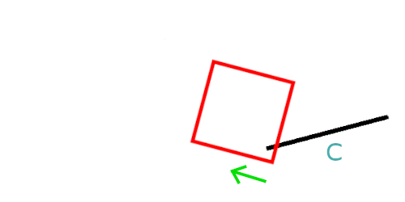
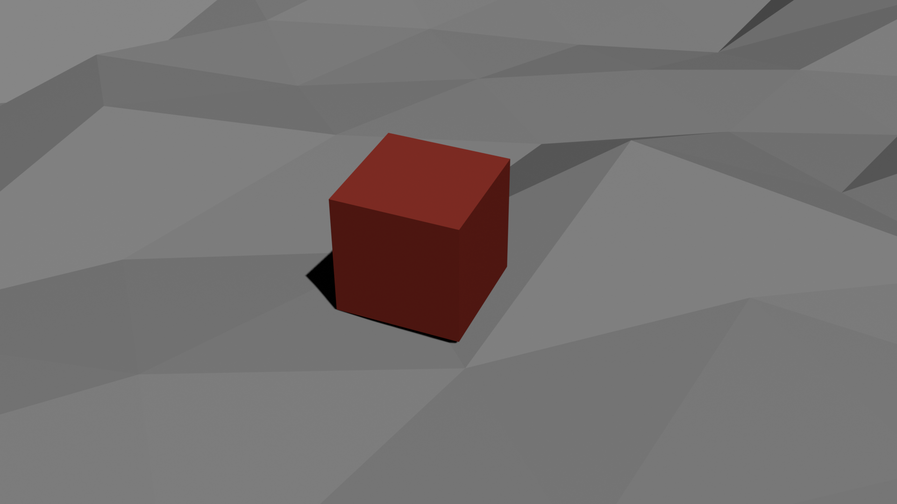

# Avoiding Internal Surface Collisions

I'd like to discuss a technique for solving a common collision issue involving a hull sliding across a surface.

As you can see, the box is smoothly sliding across the surface until it abruptly stops, appearing to have hit something. In this article, I'll explain the issue and how I solved it. This problem can also happen in two dimensions, in this case, you would have a box sliding across a set of connected line segments.

For the solution discussed here, you need a collision detection algorithm that works using two convex collision hulls such as SAT or GJK. I have yet to come across this solution discussed online, so I thought I'd share it.

## The Problem

Let's take a look at what is causing these undesired internal collisions. We'll examine and solve the problem in two deminsions, then extrapolate to three deminsions.

Let's say the box slides across the surface to the right such that it's colliding with line segments B and C.

A naive way to handle these collisions is to resolve the collision between the box and the two line segments separately. Here's is the direction of the minimum resolution vector between the box and ling segment B.

This is what any collision detection algorithm will spit out, and it's exactly what we want. If we resolve the collision using this vector, the box will sit atop the line segment as desired.

Now let's look at the direction of the minimum resolution vector for line segment C.

Resolving the collision using this vector will result in the box appearing to have hit a wall. If the box is sliding along line segment B, once it hits C, a minimum resolution vector like this could be generated and resolving such collision will cause this internal collision issue.

The same problem could happen if the box is moving left, then collides with line segment A.

## The Solution

A solution I've found, is to handle the collisions holistically, in a single step. Let's look at the collision between the box and line segments A and B again. We want the space of possible collision normals to be the inclusive range between the normal of line segment A and the normal of line segment B:

We'd like to only generate collision normals in this range. If we can, then it won't be possible to get a normal that results in an internal collision. The way to accomplish this is simple, instead of feeding each line segment to our collision detection algorithm separately, feed the entire triangle to it at once. So now, we're checking for a collision between the box and a triangle made up of line segments A and B.

This will garuntee us a collision normal in the desired range.

What about a collision with line segment C? Well if we're only trying to find the minimum resolution vector between the box and line segment B, there is only one possible normal we can generate on the right side of the line. It's the normal of line segment B, there is no range of possibilities here.

In this case, we can ensure our collision detection algorithm gives us this normal by simply extending line segment B. We extend it enough so that it is not possible to generate an internal normal. I roughly estimated the maximum length of one of these line segments, then doubled that to get the distance I extend the line.

Putting both scenarios together, when checking for a collision between the box and line segment B, we feed the two red shapes below to our collision detection algorithm.

By using this triangle, instead of the line segment, it's not possible to get an internal collision normal. As you can see, the generated hull is completely convex so we can easily feed it to common collision detection algorithms like SAT or GJK. There is no need to modify your chosen algorithm at all!

Below are all the possible scenarios.

To recap, when checking for a collision between a hull and a line segment. We generate a collision hull and feed that, instead of the line, to our collision detection algorithm. The collision hull is formed using the rules below.

1. If the line segment forms a convex angle with an adjacent line segment, the adjacent line segment's isolated vertex is included.
2. If the line segment forms a concave angle with an adjacent line segment, the line is extended.

This will garuntee our collision detection algorithm will never spit out an internal collision normal. One thing to note, the generated hull will have a minimum of 2 vertices (concave-concave case) and a maximum of 4 (convex-convex case).

## Moving to Three Deminsions

Use the same basic principals, we can apply the solution in three dimensions too. Now, we'll consider a cube sliding across a collection of connected triangular faces.

If we take a closer look at collisions between the cube and a triangular face, we see the adjacent faces form convex and concave angles as before.

Here we see two adjacent faces that form concave angles and a single adjacent face that forms a convex angle.

When checking for a collision between our cube and the highlighted face, we again generate a convex hull which is fed to the collision detection algorithm instead of the face. The collision hull is formed using the rules below.

1. If the face forms a convex angle with an adjacent face, the adjacent face's isolated vertex is included.
2. If the face forms a concave angle with an adjacent face, the face is extended.

Using these rules, the highlighted face becomes the following hull of 5 vertices.

Using this convex hull in our collision detection algorithm we're garunteed to never get an undesired internal collision normal.

Let's discuss exactly how we extend the triangular face when we have a concave angle. The normal of the adjacent face forming the convex angle must be preserved. If it's altered in any way, we could get a collision normal that does not match the geometry of the adjacent faces.

In this example, we want to calculate B' and C' from the triangular face ABC. To do so, we simply extend vertex B along ray AB. Similarly, C' is calculated by extending vertex C along ray AC. If done this way, the normals of any adjacent faces, DBA in this case, will be preserved. The normal of DBA is the same as the normal of DB'A.

Below is an example of a generated hull when all adjacent faces form concave angles. In this case, we have a hull of 6 vertices.

And here is an example when all adjacent faces form convex angles. In this case, our hull also has 6 vertices.

Again these generated hulls are completely convex so they can be used with common collision detection algorithms.

## Final Remarks

And that's it. If you generate hulls in this way, you will not get any undesired internal collision normals.

It's worth mentioning one more thing. If your set of connected line segments or triangular faces is static throughout the game, typically seen in world ground meshes, then you can precompute these hulls. There is no need to generate these hulls on the fly, per frame.